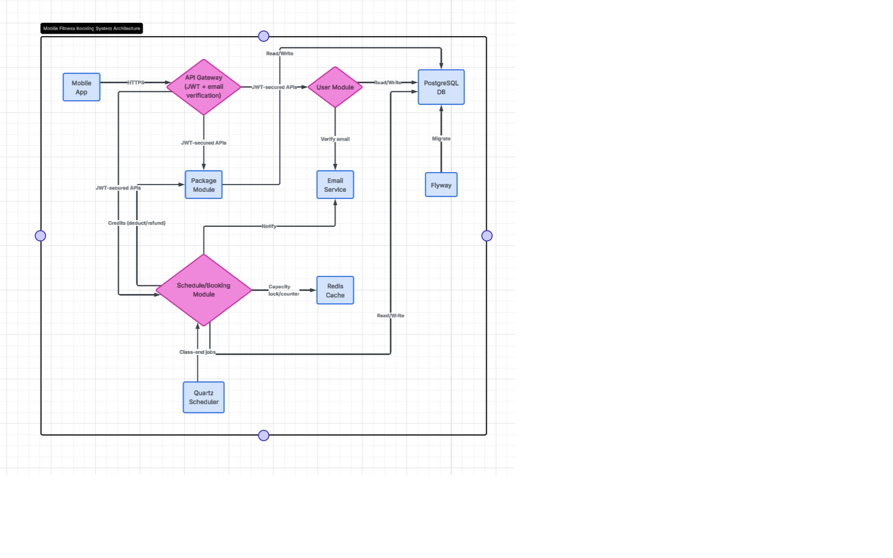
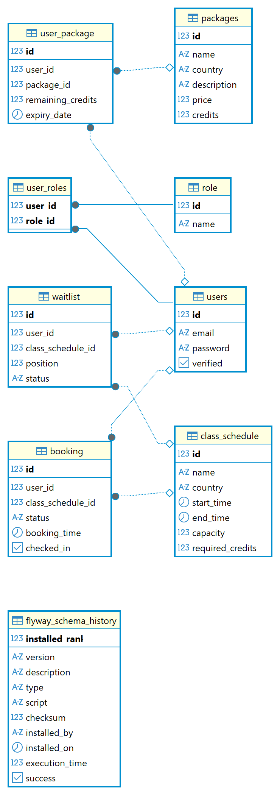

# Booking System

A comprehensive booking system for fitness classes with user management, package purchasing, credit-based bookings, waitlist functionality, and concurrency control.

## Features

- **User Management**: Registration, authentication, and JWT-based security
- **Package System**: Purchase credit packages for different countries (Singapore, Myanmar)
- **Class Booking**: Book fitness classes with credit deduction
- **Waitlist**: Automatic waitlist management when classes are full
- **Concurrency Control**: Redis-based locking and counters to prevent overbooking
- **Check-in System**: Time-based check-in for booked classes
- **Scheduled Jobs**: Automatic processing of class end events using Quartz scheduler
- **RESTful API**: Complete API with Swagger documentation
- **Database Migrations**: Flyway migrations for schema and default data

## Technologies

- **Backend**: Spring Boot 3.x
- **Database**: PostgreSQL
- **Cache**: Redis for concurrency control and counters
- **Security**: JWT authentication with Spring Security
- **API Documentation**: Swagger/OpenAPI
- **Build Tool**: Maven
- **Containerization**: Docker & Docker Compose

## Prerequisites

- Java 21 or higher
- Maven 3.6+
- Docker & Docker Compose (for containerized deployment)
- PostgreSQL & Redis (for local development without Docker)


## Quick Start with Docker Compose

1. **Clone the repository**
   ```bash
   git clone <repository-url>
   cd booking-system
   ```

2. **Set environment variables**
   Edit the `.env` file if needed (default: `user`/`password`).

3. **Build and run everything**
   ```bash
   mvn clean package -DskipTests
   docker-compose up --build
   ```

4. **Access the application**
   - API: http://localhost:8080
   - **Swagger UI**: http://localhost:8080/swagger-ui.html (interactive API docs)


## Architecture Diagram

The following diagram shows the high-level architecture of the booking system:




## Database Entity Relationship Diagram

The following diagram was generated from the actual database schema (DBeaver):




## Local Development Setup (Step-by-Step)

Follow these steps to build and run the project locally, using Docker Compose for dependencies (PostgreSQL and Redis) and running the Spring Boot app on your host:

1. **Start PostgreSQL and Redis with Docker Compose**
   ```bash
   docker-compose up -d postgres redis
   ```

2. **Configure environment variables**
   - Set the following environment variables (or update `application.yaml` as needed):
     ```bash
     export DB_USERNAME=user
     export DB_PASSWORD=password
     # Optionally set JWT_SECRET and other variables if needed
     ```

3. **Build the project**
   ```bash
   mvn clean package -DskipTests
   ```

4. **Run the application**
   ```bash
   mvn spring-boot:run
   # or run the built jar:
   java -jar target/booking-system-0.0.1-SNAPSHOT.jar
   ```

5. **Access the API and Swagger UI**
   - API: http://localhost:8080
   - Swagger UI: http://localhost:8080/swagger-ui.html

## API Documentation

The API is fully documented with Swagger. Access the interactive documentation at:
- **Swagger UI**: http://localhost:8080/swagger-ui.html
- **OpenAPI JSON**: http://localhost:8080/v3/api-docs

### Authentication

Most endpoints require JWT authentication. Use the `/auth/login` endpoint to obtain a token, then include it in the `Authorization` header as `Bearer <token>`.

## Default Data

The system comes with pre-loaded data:

### Default Admin User
- **Email**: admin@example.com
- **Password**: password

### Sample Packages
- **Singapore**: 10 credits ($100), 20 credits ($180), 50 credits ($400)
- **Myanmar**: 10 credits ($50), 20 credits ($90), 50 credits ($200)

### Sample Classes
- Various fitness classes in Singapore and Myanmar with different capacities and credit requirements

## API Endpoints Overview

### Authentication
- `POST /auth/register` - User registration
- `POST /auth/login` - User login
- `POST /auth/verify` - Email verification
- `POST /auth/reset-password` - Password reset

### Packages
- `GET /packages` - Get available packages
- `GET /packages/country/{country}` - Get packages by country
- `POST /packages/purchase` - Purchase a package
- `GET /packages/user` - Get user's purchased packages

### Bookings
- `GET /bookings/classes/{country}` - Get class schedules
- `POST /bookings/book/{classId}` - Book a class (automatically adds to waitlist if full)
- `DELETE /bookings/cancel/{bookingId}` - Cancel booking
- `GET /bookings/user` - Get user's bookings
- `POST /bookings/checkin/{bookingId}` - Check-in to class

## Database Schema

### Key Entities
- **UserEntity**: User accounts with roles
- **PackageEntity**: Available packages with pricing
- **UserPackage**: User's purchased packages with remaining credits
- **ClassSchedule**: Class schedules with capacity and requirements
- **Booking**: Confirmed bookings
- **Waitlist**: Waitlist entries with position


### Migrations
Database schema and default data are managed through Flyway migrations in `src/main/resources/db/migration/`.

The following Flyway migration scripts are included:

- **V1__Create_tables.sql**: Creates all core tables (users, packages, bookings, schedules, waitlist, etc.)
- **V2__Insert_default_data.sql**: Inserts default admin user, sample packages, and initial data for testing/demo.
- **V3__Add_more_classes.sql**: Adds additional sample class schedules for more comprehensive testing.

These scripts ensure your database is always up-to-date and pre-populated for development, testing, and demo purposes.

## Testing

### Automated Tests
Run unit and integration tests:
```bash
mvn test
```


### API Testing Scripts
The project includes comprehensive test scripts in `docs/test_scripts/` to simulate concurrent booking scenarios and user flows:

- **test_api.sh**: Main test script for 50 concurrent users
- **test_api_user_create.sh**: User creation script
- **test_api.bat**: Windows batch version

To run the test script:
```bash
cd docs/test_scripts
chmod +x test_api.sh
./test_api.sh
```

The test scripts simulate:
- User registration and package purchase
- Concurrent booking attempts (50 users booking simultaneously)
- Cancellation and waitlist promotion
- Verification of no overbooking (concurrency control)

## Architecture

### Concurrency Control
The system uses Redis for distributed locking and counters to handle concurrent bookings:
- **Locking**: `lock:class:{classId}` prevents race conditions during booking
- **Counters**: `booked:class:{classId}` tracks real-time booking counts
- **Atomic Operations**: Redis increment/decrement ensure consistency

### Scheduled Jobs
Quartz Scheduler is used for time-based job execution:
- **Class End Jobs**: Automatically triggered at class end time to process refunds for waitlisted users
- **Spring Integration**: Jobs are Spring-managed with dependency injection enabled

### Service Layer
- **AuthService**: Handles authentication and user management
- **PackageService**: Manages package purchasing and credit tracking
- **BookingService**: Core booking logic with concurrency control
- **ClassSchedulerService**: Manages Quartz-based scheduling for class end processing

## Configuration

### Application Properties
Key configuration in `application.yaml`:
- Database connection settings
- JWT configuration
- Redis connection
- Flyway settings

### Environment Variables
- `DB_USERNAME`: Database username
- `DB_PASSWORD`: Database password
- `JWT_SECRET`: JWT signing secret (auto-generated if not set)

## Deployment


### Docker Compose
The `docker-compose.yml` includes:
- Spring Boot application (see `app` service)
- PostgreSQL database
- Redis cache
- Automatic service discovery and environment variable configuration

You can modify the `app` service in `docker-compose.yml` to enable or adjust the Spring Boot container as needed.

### Production Considerations
- Use external PostgreSQL and Redis instances
- Configure proper environment variables
- Set up monitoring and logging
- Enable HTTPS in production

## Troubleshooting

### Common Issues
1. **Port conflicts**: Ensure ports 8080, 5432, 6379 are available
2. **Database connection**: Verify PostgreSQL credentials
3. **Redis connection**: Ensure Redis is running and accessible
4. **Migrations fail**: Check database permissions and existing schema

### Logs
Check application logs for detailed error information:
```bash
docker-compose logs app
```

## Contributing

1. Fork the repository
2. Create a feature branch
3. Make changes with tests
4. Run test suite
5. Submit pull request

## License

This project is licensed under the MIT License - see the LICENSE file for details.

---

*Built with Spring Boot 3.x and modern Java practices*